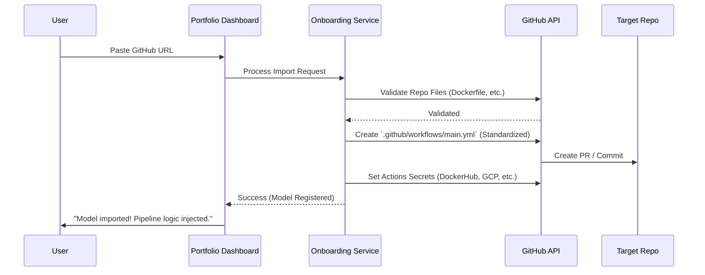

# 🛠️ Feature Design: GitHub Auto-Onboarding Button

This document outlines the architecture and user experience for a "GitHub Import" button that transforms this pipeline into a **Model Management Platform**.

## 1. Conceptual Design
Instead of a developer manually following the `ONBOARDING_GUIDE.md`, a UI button in the Dashboard will automate the integration.

### The Vision
A user pastes a GitHub URL (e.g., `https://github.com/user/my-cool-model`) into the Dashboard. The system:
1.  **Validates**: Checks for a `Dockerfile` and `requirements.txt`.
2.  **Instruments**: Uses the GitHub API to create a PR adding the standardized `main.yml` pointing to your `shared-workflows-repo`.
3.  **Configures**: Securely injects necessary secrets into the target repository.
4.  **Monitors**: Automatically adds the new model to the Dashboard's Overview and History tabs.

---

## 2. Technical Architecture



---

## 3. UI Prototype (Dashboard Update)

```javascript
/* Suggested Addition to App.jsx */
function ImportProjectModal() {
  return (
    <div className="modal-overlay">
      <div className="modal-card">
        <h3>🚀 Import GitHub Repository</h3>
        <p>Enter the URL of an ML project to auto-onboard it to the MLOps pipeline.</p>
        <input type="text" placeholder="https://github.com/username/repo" />
        <div className="features-checklist">
          <div>✓ Inject Standardized CI/CD</div>
          <div>✓ Configure Security Scanning</div>
          <div>✓ Set Up GKE Deployment</div>
        </div>
        <button className="import-btn">⚡ Start Auto-Onboarding</button>
      </div>
    </div>
  );
}
```

---

---

## 5. Infrastructure & Cost Considerations

When importing a third-party repository, the following resource and cost implications apply:

### 🚀 GKE Deployment
*   **Target**: By default, the injected `main.yml` will point to **your** GKE cluster configured in the `shared-workflows-repo`.
*   **Namespaces**: Each imported repo can be configured to deploy into its own Kubernetes namespace (e.g., `ml-repo-name-staging`) to ensure isolation and prevent name collisions.
*   **Resources**: New deployments will consume CPU and Memory on your GKE nodes. You may need to enable **GKE Autopilot** or **Horizontal Pod Autoscaling (HPA)** to handle the increased load.

### 💹 Unified Visualization (Charts & Metrics)
This is where the platform moves from a "showcase" to a "command center":

*   **Project Multi-Tenancy**: The Dashboard will gain a **Model Selector** dropdown.
*   **Dynamic Data Feeds**: Instead of hardcoded fraud metrics, the charts will dynamically query columns from **MLflow** based on the selected project's metadata.
*   **Standardized Observability**: Every imported repo gets its own **Prometheus/Grafana** dashboard automatically, visualizing real-time traffic and latency on GKE for that specific model.
*   **History Sync**: The deployment table will filter by the active project, showing you the specific Git SHAs and deployment statuses for the third-party repo.

> [!IMPORTANT]
> Because you are using a **Shared Workflow Library**, any new repository you import is "born" with these charts. The moment the first pipeline runs, the metrics appear.
