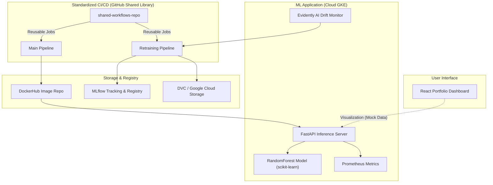

## 🎯 Core Mission
This project serves a dual purpose: a functional business goal and a technical engineering goal.

### 🛡️ Functional: Fraud Prevention
The immediate goal is to protect transactions in real-time. The application analyzes incoming data (amount, location, timing) using a **RandomForest Model** to predict the likelihood of fraud, allowing for automatic blocking of high-risk activity.

### ⚙️ Technical: MLOps Excellence
The true mission is to demonstrate a **Production-Grade MLOps Pipeline**. It ensures that the model is not just "deployed" but "managed." This includes:
*   **Standardization**: Centralized CI/CD via a Shared Library Repo.
*   **Health Monitoring**: Automated drift detection using Evidently AI.
*   **Self-Retraining**: Automated training and promotion loops when data patterns change.
*   **Infrastructure as Code**: Helm-based deployments for consistency across environments.

---

## 🏗️ Architecture Diagram
The system follows a modular architecture split into infrastructure (reusable workflows), application logic (ML & API), and visualization (dashboard).

---

## 🌓 Component Breakdown: Static vs. Functional

To understand how the app works, it's important to differentiate between what is a **Mock Interface** and what is a **Functional Backend**.

| Component | Nature | What's Really Working? |
| :--- | :--- | :--- |
| **User Dashboard** | 🏛️ **Static / Mock** | The charts, accuracy stats, and "Inference Demo" are generated locally in the browser Using JavaScript logic. They are not currently connected to the live GKE API. |
| **Inference API** | ⚙️ **Real Backend** | The FastAPI server in `ml-app-repo` is fully functional. It can take real data, run it through the model, and return a real fraud score. |
| **CI/CD Pipelines** | 🧪 **Real Logic** | The GitHub Actions workflows actually run tests, build Docker images, and deploy your code to GKE. |
| **Retraining Loop** | 🤖 **Real Backend** | The `retrain.yml` workflow actually pulls data from DVC, trains a model, and logs everything to MLflow. |
| **Infrastructure** | ☸️ **Real Cloud** | Your GKE cluster, Docker Hub, and GCS buckets are real endpoints where your code and data live. |

> [!NOTE]
> The Dashboard is currently a **High-Fidelity Showcase**. It demonstrates *how* the MLOps data would be presented, while the heavy lifting happens in the background Python and YAML logic.

## ⚡ Core Features
- **Shared Library Pattern**: Centralized automation using GitHub Actions reusable workflows for tests, builds, scans, and deploys.
- **Automated Model Lifecycle**: Scheduled retraining (weekly) that compares new models against production benchmarks before promotion.
- **Infrastructure as Code (IaC)**: Kubernetes deployment managed via Helm charts with specific configurations for Staging and Production.
- **Security First**: Integrated Trivy scanning to block deployments with HIGH or CRITICAL vulnerabilities.
- **Data & Model Versioning**: Full lineage tracking using DVC (for datasets) and MLflow (for models).
- **Observability**: Real-time metrics via Prometheus and data drift detection using Evidently AI.
- **Interactive Dashboard**: A 4-tab React application for real-time inference, pipeline visualization, and model history.

---

---

## 🔄 Project Workflows

### 🧑‍💻 User / Developer Workflow
This workflow describes the manual steps taken by a developer to contribute and deploy changes.

1.  **Local Development**:
    *   Clone the repository and install dependencies from `requirements.txt`.
    *   Train the model locally using `python src/train.py` to verify logic.
    *   Test the API locally using `uvicorn app.main:app` and Swagger UI (`/docs`).
2.  **Feature Contribution**:
    *   Create a feature branch (e.g., `feature/add-new-metric`).
    *   Commit changes and push to the remote repository.
3.  **Peer Review & Staging**:
    *   Open a Pull Request (PR) from `feature/*` to `develop`.
    *   Once merged, the system auto-deploys to the **Staging Environment** on GKE.
    *   The developer verifies the change in the staging dashboard/API.
4.  **Production Promotion**:
    *   Open a PR from `develop` to `main`.
    *   **Manual Gate**: A lead developer or DevOps engineer must manually approve the deployment in GitHub Actions.
    *   Upon approval, the system executes a zero-downtime rolling update to the **Production Environment**.

### 🤖 Automated System Workflow (CI/CD & MLOps)
This workflow describes the automated background logic triggered by events.

1.  **Continuous Integration (CI)**:
    *   **Trigger**: Push to `develop` or `main`.
    *   **Action**: Runs `pytest` (logic check), `flake8` (linting), and `coverage` (test depth).
    *   **Build**: Generates a Docker image with a unique Git SHA tag.
    *   **Security**: Scans the image with **Trivy**; pipeline fails if `CRITICAL` CVEs are found.
2.  **Continuous Deployment (CD)**:
    *   **Trigger**: Successful CI on `develop` or manual approval on `main`.
    *   **Action**: Executes `helm upgrade` targeting the specific GKE cluster/namespace.
    *   **Notification**: Status results (success/failure) are pushed to the team's Slack channel.
3.  **Automated Model Retraining Loop**:
    *   **Trigger**: Weekly Cron job (Sunday 2 AM) OR **Data Drift Detection** alert from Evidently AI.
    *   **Data Pull**: System pulls the latest versioned dataset from GCS via DVC.
    *   **Training**: Trains a new model candidate and logs metrics/artifacts to **MLflow**.
    *   **Evaluation**: Compares candidate metrics (F1-score, AUC) against the current Production model.
    *   **Promotion**: If the candidate is better (by >2% threshold), it is tagged as `Production` in the MLflow Model Registry and triggers a new CD build.

---

## 🛠️ Tech Stack
- **Languages**: Python (Backend/ML), JavaScript (Frontend)
- **Frameworks**: FastAPI, React.js
- **Machine Learning**: Scikit-Learn, Pandas, Numpy
- **MLOps Tools**: MLflow, DVC, Evidently AI
- **DevOps/Infrastructure**: GitHub Actions, Docker, Kubernetes (GKE), Helm
- **Monitoring**: Prometheus, Recharts (Visuals)
- **Deployment**: Google Cloud Platform (GCP), Vercel (Frontend)

---

## 🚀 Future Roadmap (What's Next?)
- [ ] **GitHub Auto-Onboarding**: Develop a "One-Click Import" button in the dashboard to automatically test, secure, and deploy any GitHub repository. (See [Architecture Design](file:///d:/MLops/AUTO_ONBOARDING_ARCH.md))
- [ ] **Automated Rollback**: Implement logic to revert to a previous model if production metrics drop below a threshold.
- [ ] **A/B Testing**: Support for Canary or Shadow deployments to test models on live traffic safely.
- [ ] **Feature Store**: Integrate Feast for centralized feature management and point-in-time joins.
- [ ] **Enhanced XAI**: Integrate SHAP or LIME reports directly into the Dashboard for model interpretability.
- [ ] **Authentication**: Implement JWT-based auth for the Inference API and Dashboard.
