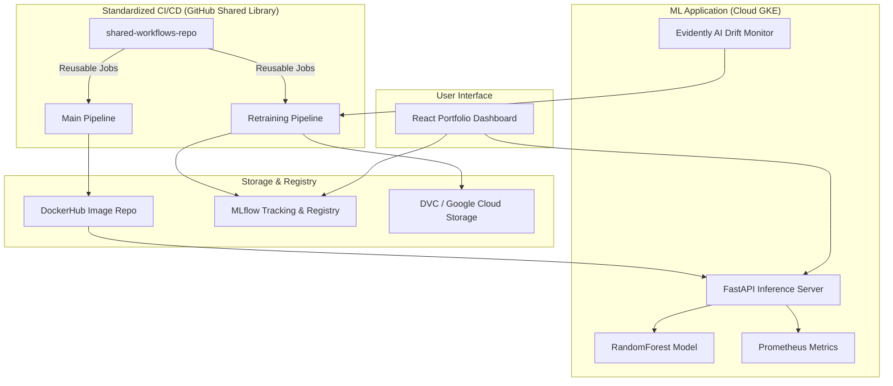

# 🛡️ Fraud Detection MLOps Platform — Project Overview

## 🎯 Mission
To build a production-grade, end-to-end MLOps ecosystem that automates the lifecycle of a Fraud Detection model—from data versioning and standardized CI/CD pipelines to automated retraining and real-time monitoring.

---

## 🏗️ Architecture Diagram
The system follows a modular architecture split into infrastructure (reusable workflows), application logic (ML & API), and visualization (dashboard).

---

## ⚡ Core Features
- **Shared Library Pattern**: Centralized automation using GitHub Actions reusable workflows for tests, builds, scans, and deploys.
- **Automated Model Lifecycle**: Scheduled retraining (weekly) that compares new models against production benchmarks before promotion.
- **Infrastructure as Code (IaC)**: Kubernetes deployment managed via Helm charts with specific configurations for Staging and Production.
- **Security First**: Integrated Trivy scanning to block deployments with HIGH or CRITICAL vulnerabilities.
- **Data & Model Versioning**: Full lineage tracking using DVC (for datasets) and MLflow (for models).
- **Observability**: Real-time metrics via Prometheus and data drift detection using Evidently AI.
- **Interactive Dashboard**: A 4-tab React application for real-time inference, pipeline visualization, and model history.

---

## 🔄 User & System Workflow

### 1. Development & Deployment
1. **Push**: Developer pushes a feature branch to `develop`.
2. **CI**: Shared workflows run pytest, flake8, and Docker builds.
3. **Staging**: The image is auto-deployed to GKE Staging.
4. **Approval**: PR to `main` triggers a manual approval gate in GitHub Environments.
5. **Production**: Once approved, the model is deployed to the Production cluster with zero downtime.

### 2. Monitoring & Retraining
1. **Drift Detection**: Evidently AI checks for distribution shifts in incoming data.
2. **Trigger**: If drift is detected OR on a Sunday cron schedule, the retraining pipeline starts.
3. **Evaluation**: New model metrics are compared against the current Production model.
4. **Promotion**: If the new model is statistically better, it is registered in MLflow and auto-deployed.

---

## 🛠️ Tech Stack
- **Languages**: Python (Backend/ML), JavaScript (Frontend)
- **Frameworks**: FastAPI, React.js
- **Machine Learning**: Scikit-Learn, Pandas, Numpy
- **MLOps Tools**: MLflow, DVC, Evidently AI
- **DevOps/Infrastructure**: GitHub Actions, Docker, Kubernetes (GKE), Helm
- **Monitoring**: Prometheus, Recharts (Visuals)
- **Deployment**: Google Cloud Platform (GCP), Vercel (Frontend)

---

## 🚀 Future Roadmap (What's Next?)
- [ ] **Automated Rollback**: Implement logic to revert to a previous model if production metrics drop below a threshold.
- [ ] **A/B Testing**: Support for Canary or Shadow deployments to test models on live traffic safely.
- [ ] **Feature Store**: Integrate Feast for centralized feature management and point-in-time joins.
- [ ] **Enhanced XAI**: Integrate SHAP or LIME reports directly into the Dashboard for model interpretability.
- [ ] **Authentication**: Implement JWT-based auth for the Inference API and Dashboard.
